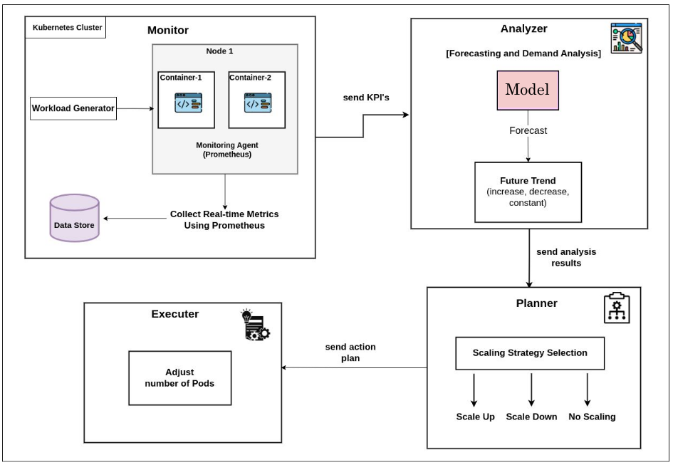
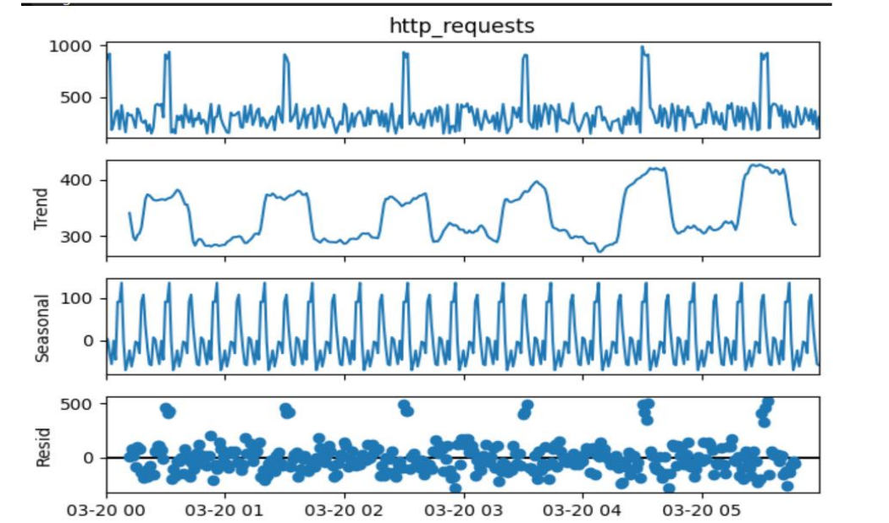

[](https://www.python.org/)
[](https://opensource.org/licenses/MIT)

# Proactive Autoscaling in Cloud-Based Containerized Applications Using Machine Learning

An end-to-end solution for predicting workload trends
and automatically scaling containerized applications
in cloud environments to maintain performance and cost efficiency.

---

🔖 **Table of Contents**

- [🏗️ MAPE Architecture](#architecture)
- [📂 Project Structure](#project-structure)
- [⚙️ Getting Started](#2-getting-started)
- [🛠️ Module Details](#3-module-details)
  - [Model & Forecasting](#31-code-model--forecasting)
  - [Dataset (Synthetic Traffic)](#32-dataset-synthetic-traffic)
  - [Dashboard (Monitoring & Control)](#33-fyp-dashboard-monitoring--control)
- [🚀 Implementation Steps](#5-implementation-steps-implementation-steps)
- [📄 License](#6-license)

---

## Architecture

Our system follows the MAPE loop (Monitor, Analyze, Plan, Execute) to anticipate and adapt to traffic changes:

 - 🔍 Monitor: Continuously gather HTTP request metrics via a synthetic data generator and Prometheus.

 - 📊 Analyze: Preprocess metrics and run an LSTM forecasting model to predict upcoming load.

 - 🧠 Plan: Determine optimal pod replica counts based on forecast thresholds.

 - ⚙️ Execute: Use the Kubernetes API to scale deployments proactively.




## 📂 Project Structure

```
FYP_Proactive_Autoscaling_using_MachineLearning/
├── Code/                  # Model training, forecasting, and inference
│   ├── model/             # Forecasting model architectures
│   ├── inference/         # Prediction & autoscaling integration
│   └── README.md          # Detailed instructions for model code
│
├── Dataset/               # Synthetic traffic dataset
│   ├── 30_day_traffic_with_metrics.csv
│   └── README.md          # Dataset description & sample usage
│
├── fyp-dashboard/         # Kubernetes dashboard frontend & backend
│   ├── frontend/          # React application
│   ├── backend/           # FastAPI service for metrics & auth
│   └── README.md          # Dashboard setup & usage
│
└── README.md              # (You are here) Project overview & instructions
```

---

## 1. Overview

This project implements a **proactive autoscaling** system:

1. **Forecast** future HTTP request traffic using time series modeling.
2. **Generate** or **consume** synthetic traffic data for model development.
3. **Integrate** forecasts into a Kubernetes environment, scaling pods ahead of demand.
4. **Monitor** via a React-based dashboard with authentication, history tracking, and resource controls.

### Goals

* **Reduce latency** by avoiding resource exhaustion
* **Optimize cost** by minimizing idle resources
* **Validate** autoscaling logic against realistic traffic patterns

---

## 2. Getting Started

### Prerequisites

* **Python 3.7+**, pip
* **Node.js (v14+)** & **npm (v6+)**
* **Kubernetes cluster** (minikube)

### Root Deployment

1. **Clone the repository**

   ```bash
   git clone git@github.com:Mohsin-Kn/FYP_Proactive_Autoscaling_using_MachineLearning.git
   cd FYP_Proactive_Autoscaling_using_MachineLearning
   ```

2. **Review module READMEs**: Each subfolder contains detailed setup and usage steps:

   * **Code/**: model workflows
   * **Dataset/**: data description & loading
   * **fyp-dashboard/**: dashboard installation

---

## 3. Module Details

### 3.1 Code (Model & Forecasting)

* **Data Preparation**: Scripts to ingest, clean, and feature-engineer traffic metrics.
* **Model Architectures**: Custom positional encoding and TensorFlow-based forecasting networks.
* **Training Pipelines**: Hyperparameter tuning, checkpoints, and logging.
* **Inference & Autoscaling**: Predict next-day traffic and interface with Kubernetes API to scale deployments.

> See `Code/README.md` for commands, configuration files, and tips on customizing training.

### 3.2 Dataset (Synthetic Traffic)

* **Synthetic Data Generator**: Produces minute-level request counts over 30 days, with realistic spikes, dips, and noise.
* **Usage**: Ideal for benchmarking and stress-testing autoscaling logic.



### 3.3 fyp-dashboard (Monitoring & Control)

* **Frontend**: React dashboard with secure admin login, resource overviews, and time-series charts.
* **Backend**: FastAPI service providing metrics, authentication, and scaling endpoints.
* **Features**: Pod management, history tracking, settings configuration, responsive UI.

> See `fyp-dashboard/README.md` to install dependencies, run frontend/backend, and configure admin credentials.

---

## 5. Implementation Steps. Implementation Steps

This section outlines the detailed implementation workflow followed in building the proactive autoscaling system:

### 5.1 Minikube Cluster Setup

We began by setting up a local Kubernetes cluster using **Minikube**, allowing us to simulate a real production environment on our development machines. This included configuring the Kubernetes dashboard, enabling the metrics server, and setting up basic networking and storage resources for deploying applications.

### 5.2 Containerized Application Deployment

We created Docker containers for our model services, backend APIs, and frontend dashboard. These were packaged with Kubernetes manifests for deployments, services, and autoscaling configurations. The application was then deployed as pods within the Minikube cluster, ensuring it was accessible via a LoadBalancer or NodePort service.

### 5.3 Forecasting Model Training & Integration

Our core innovation involved training a time series forecasting model to predict future traffic based on historical patterns. Once trained, this model was integrated into a custom autoscaler component which periodically predicts future load and applies Kubernetes scaling logic (e.g., updating the number of pod replicas based on forecasted thresholds).

### 5.4 Custom Autoscaler Development

We implemented a lightweight Python-based controller that listens to forecast outputs and programmatically scales the Kubernetes deployments using the Kubernetes API. This autoscaler replaces traditional CPU-based reactive scaling by making proactive decisions before the demand hits.

### 5.5 Dashboard for Real-Time Monitoring

To visualize the entire pipeline, we built a React-based frontend dashboard backed by a FastAPI service. It includes secure admin login, real-time pod status updates, request volume history, and controls for managing autoscaling parameters. The dashboard was deployed into the cluster and linked with the autoscaler for observability.

### 5.6 End-to-End Testing

We used our synthetic traffic dataset to simulate real-world HTTP request patterns. The entire workflow was validated by observing the autoscaler’s ability to predict traffic spikes, scale the system appropriately, and maintain low response latency with efficient resource utilization. Logs, charts, and metrics were reviewed to confirm that the autoscaler outperformed standard reactive strategies.

This comprehensive implementation successfully demonstrated proactive autoscaling in a cloud-native environment using container orchestration and machine learning.

This section summarizes the key implementation tasks we performed:

1. **Minikube Cluster Setup**: Installed and configured a local Kubernetes cluster using Minikube for development and testing.
2. **Application Deployment**: Defined Kubernetes manifests to deploy our containerized application pods and services.
3. **Autoscaler Integration**: Incorporated our trained time-series forecasting model into a custom autoscaler component that watches traffic predictions and adjusts pod replicas automatically.
4. **Dashboard Monitoring**: Deployed the React/FastAPI dashboard into the cluster to visualize resource usage, scaling events, and system health in real time.
5. **Validation & Testing**: Simulated workloads using the synthetic dataset, verified that pods scaled up/down according to forecasted demand, and measured latency and cost savings.

---

## 6. License

This project is released under the **MIT License**.
